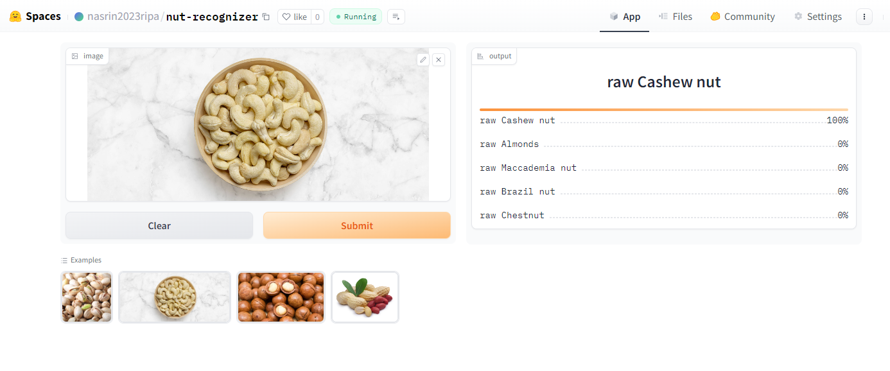

# Nut Recognizer

An image classification model for nut recognition, including data collection, cleaning, model training, deployment, and API integration.

## Overview

The Nut Recognizer model is capable of classifying 14 different types of nuts:

1. Almonds
2. Brazil nuts
3. Cashew nuts
4. Chestnuts
5. Ginkgo nuts
6. Hazelnuts
7. Hickory nuts
8. Macadamia nuts
9. Pecans
10. Pili nuts
11. Pine nuts
12. Peanuts
13. Pistachio nuts
14. Walnuts

## Dataset Preparation

- **Data Collection:** The dataset was downloaded using DuckDuckGo by searching for each nut type.
- **DataLoader:** The fastai DataBlock API was used to set up the DataLoader.
- **Data Augmentation:** Default data augmentation provided by fastai was utilized, taking advantage of GPU acceleration.
- For more details, refer to the `notebooks/data_prep_train_clean.ipynb` notebook.

## Training and Data Cleaning

- **Training:** The model was fine-tuned using the resnet34 architecture for 5 epochs, repeated 3 times, achieving an accuracy of approximately 89%.
- **Data Cleaning:** A significant amount of time was spent on data cleaning due to noise in the collected data. The fastai ImageClassifierCleaner tool was used to clean and update the dataset after each training iteration, except for the final model iteration.

## Model Deployment

The trained model was deployed to the HuggingFace Spaces Gradio App. You can find the implementation in the `deployment` folder or access it [here](https://huggingface.co/spaces/nasrin2023ripa/nut-recognizer). Below is a screenshot of the deployed application:

## API Integration with GitHub Pages

The deployed model API is integrated into the [GitHub Pages Website](https://nasrinripa.github.io/nut-recognizer/). Implementation details and other related information can be found in the `docs` folder.

